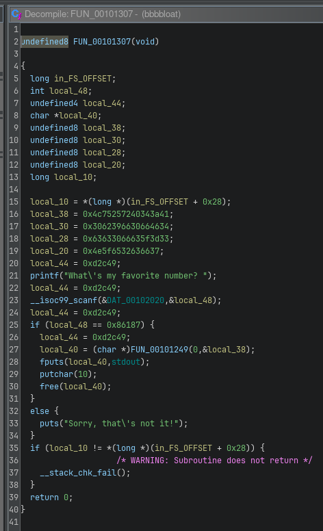

# Writeup for picoCTF 2022 : Bbbbloat

## Tools:
- pwndbg (Enhanced GDB debugger)
- file command (file type analysis)
- checksec (binary security analysis)
- Ghidra (NSA reverse engineering framework)
- Hexadecimal to decimal conversion

## Steps:

### 1. Initial Binary Analysis and Reconnaissance
I began my analysis by examining the binary using standard reconnaissance tools to understand its basic characteristics and potential security features.

**File Type Analysis:**
Using the `file` command, I examined the binary's basic properties to understand what type of executable I was dealing with and any immediately apparent characteristics.

**Security Feature Assessment:**
I employed `checksec` to analyze the binary's security features and protections. This analysis revealed that the binary appeared to be obfuscated, which immediately suggested that I would need to use more sophisticated analysis techniques to understand its functionality.

### 2. Dynamic Analysis Attempt with pwndbg
My initial approach involved using pwndbg, an enhanced GDB plugin, to perform dynamic analysis of the binary. I attempted to:

- Set breakpoints at key functions
- Examine the program's execution flow
- Analyze register states and memory contents
- Identify potential entry points for reverse engineering

However, the dynamic analysis approach proved less effective than expected. The obfuscation present in the binary made it difficult to gain meaningful insights through runtime debugging alone, indicating that I needed to switch to a different analytical approach.

### 3. Static Analysis Strategy with Ghidra
Recognizing that dynamic analysis was not yielding the desired results, I pivoted to static analysis using Ghidra, NSA's powerful reverse engineering framework. This approach allowed me to examine the binary's structure without the complications introduced by obfuscation during runtime.

### 4. String Analysis and Cross-Reference Tracking
My breakthrough came through systematic string analysis within Ghidra:

**String Discovery Process:**
1. **Navigation**: I accessed Ghidra's string analysis features through `Window → Defined Strings`
2. **Pattern Matching**: I searched for the distinctive string "What's my favorite ..." which appeared to be part of the program's user interaction
3. **Cross-Reference Analysis**: Upon locating this string, I identified that it had cross-references to other parts of the code

**Following the Cross-Reference:**
When I clicked on the cross-reference, Ghidra automatically navigated me to the memory location where this string was being used. This location turned out to be crucial for understanding the program's logic.

### 5. Decompilation and Logic Analysis
At the cross-referenced location, Ghidra's decompiler was able to generate readable pseudocode that revealed the program's underlying logic:



The decompiled pseudocode provided several critical insights:
- The program was implementing a number comparison mechanism
- There was a hardcoded hexadecimal value that served as the correct answer
- The comparison logic determined whether the user's input matched the expected value

### 6. Hexadecimal Value Extraction and Conversion
Through analysis of the decompiled code, I identified the hardcoded hexadecimal value that the program was expecting as input. This value needed to be converted to decimal format for user input.

**Conversion Process:**
- **Source**: Hexadecimal value extracted from the decompiled code
- **Target**: Decimal equivalent for program input
- **Result**: 549255

This conversion gave me the exact decimal number that the program was expecting to receive from user input.

### 7. Flag Retrieval Through Correct Input
With the correct number identified, I executed the binary and provided the converted decimal value:

```bash
./bbbbloat
What's my favorite number? 549255
```

The program accepted this input as correct and immediately revealed the flag, confirming that my analysis and conversion were accurate.

### 8. Learning Outcomes
This challenge effectively demonstrated several important reverse engineering concepts:

- **Tool Selection**: Understanding when to switch between dynamic and static analysis approaches
- **Obfuscation Handling**: Recognizing how obfuscation can complicate dynamic analysis
- **String Analysis**: Using string references as entry points into program logic
- **Cross-Reference Tracking**: Following code references to understand program flow
- **Decompilation Benefits**: Leveraging decompilers to understand complex assembly code

The challenge showed that while obfuscation can make initial analysis more difficult, systematic use of the right static analysis tools can still reveal the underlying program logic effectively.

## Flag:
```picoCTF{cu7_7h3_bl047_44f74a60}```
