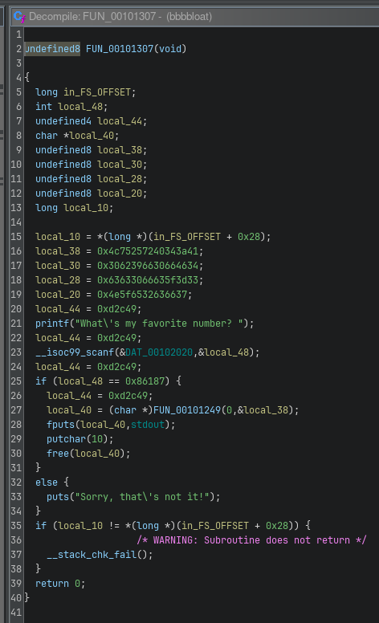

# Writeup for picoCTF-2022 : Bbbbloat

## Steps:
1) For this one I was playing around in pwndbg, checking its file type and security features with file and checksec. Ultimately none of this helped me much besides showing the binary is obfuscated.
2) Pwndbg didn't do much for me, so I opened the binary in ghidra -> window -> defined strings -> looked for "What's my favorite ..." string and clicked it. The string had a cross reference to it, so I clicked it and it sent me to a memory location where this was being used. Here the ghidra decompiler was able to provide visible pseudocode which helped a lot.



3) The requested number in the binary converted from hex to decimal is : 549255
4) Entering this when running the binary we get the flag.

## Flag:
```picoCTF{cu7_7h3_bl047_44f74a60}```
