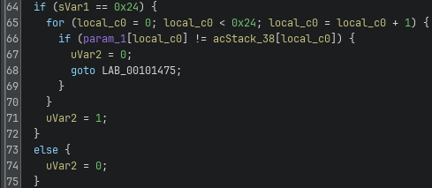
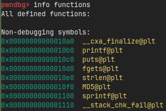
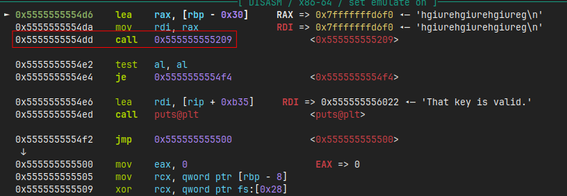
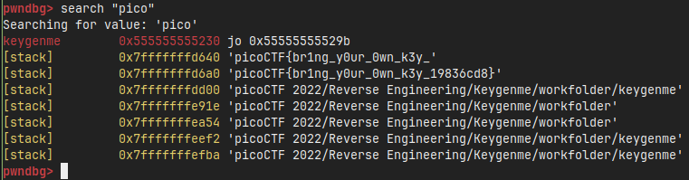

# Writeup for picoCTF-2022 : Keygenme

## Steps
- First give the application execution permissions:
```chmod +x keygenme```

- After running the application we see that we need a license:


- Opening this keygen in ghidra, we can locate one of the output strings under 'Defined strings' and follow the cross-reference to it and see the decompiled code of the main function:


- In the decompiled main function we can see that before the if-branch there's a validation process where `cVar1` is being assigned the result of some function (presumably some validation function) with `local_38` as argument which is the user input of the requested license with size 40 characters. However, we can see that fgets only takes `0x25` in hex or `37` in decimal as the size of the input, so we can safely assume that the input is capped at 37 characters or rather 36 characters to leave room for the null terminator `\0`.

- If we dig deeper into the presumed validation function to see the structure and decompiled pseudocode of it, we see a bunch of poorly decompiled code using Ghidra, this task would be better for IDA64 or some other decompiler. However, there was a part of the decompiled code that did turn out to be useful as shown in the picture below but still knowing this, we can try to use GDB instead.



- In the picture above we can see that there's an if statement checking if the length of the given argument is `0x24` or `36` characters long. We can use this to get to the assembly in GDB, find the correct compare instruction, set a breakpoint and see if there are any useful strings that can point to the flag. 

- Opening up GDB using `gdb keygenme`, we can immidietely run `info functions` to see what functions we can work with. As we can see the main function is not there because the binary is `stripped` which you can see by running `file keygenme`, this means that the debugging information and symbols have been removed from the binary, however, we do have printf and fgets which we can use to get to the main function.



- Let's try to utilize fgets to get to the main function and from there see what we can do. This can be done by setting a breakpoint at fgets by typing `b *fgets` and then `r` to run the application, this will break or pause the program when fgets is called. As we're not really interested in the intricacies of the fgets function, we can type `finish`to skip the fgets function which would then load the next instruction in the code, as a reference you can look at the decompiled main code to see where we are getting at.

- Now that we've skipped the fgets function, we're being asked to provide the license key, in this specific case it doesn't really matter what kind of input you give here as we will just see where it leads us and see what other nearby instructions there are that could be of use.



- We can see that there's an interesting nearby call to `0x555555555209`, why is this interesting? Well if you look at the decoded main function, we can see that after getting the input from fgets which we just provided, there's a function call being made for cVar1, this as we previously mentioned is presumably some sort of validation function, so now we've dug our way to the function using GDB. Perhaps we can find the compare function we're interested in and see if any strings are interesting from there. So let's set a breakpoint and continue, `b *0x555555555209`, `c`.

- Now that we're at our desired address, let's type `layout asm` and then `n` to continue to the next instruction and have more view of the memory region. Scrolling down we can notice the following instruction `0x555555555419  cmp    rax,0x24` which compares a size of `0x24` or `36` with the `rax` register. Let's try to set a breakpoint on this instruction and continue, `b *0x555555555419`, `c`.

- Let's try now to see if there are any interesting strings here, `search "pico"`



And there we go, we found the flag :D

## Flag
```picoCTF{br1ng_y0ur_0wn_k3y_19836cd8}```
