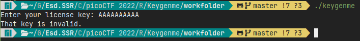
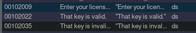
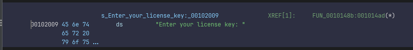
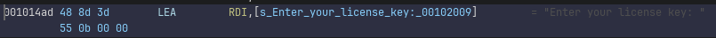
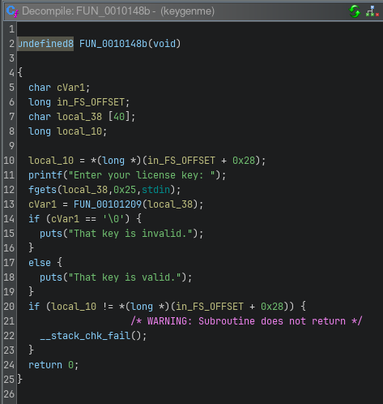

# Writeup for picoCTF-2022 : Keygenme

## Steps
- First give the application execution permissions:
```chmod +x keygenme```

- After running the application we see that we need a license:



- Opening this keygen in ghidra, we can locate one of the output strings under 'Defined strings' and follow the cross-reference to it and see the decompiled code of the main function:






## Flag
```picoCTF{br1ng_y0ur_0wn_k3y_19836cd8}```
