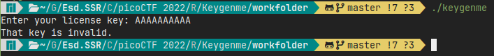
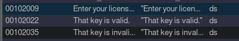
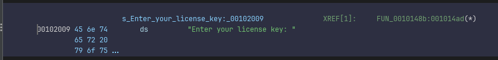
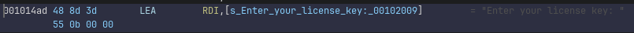
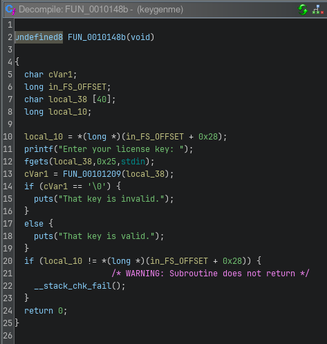
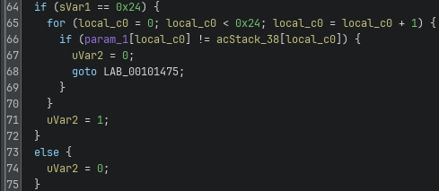
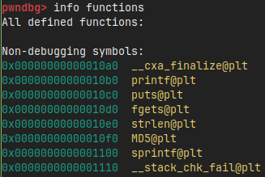
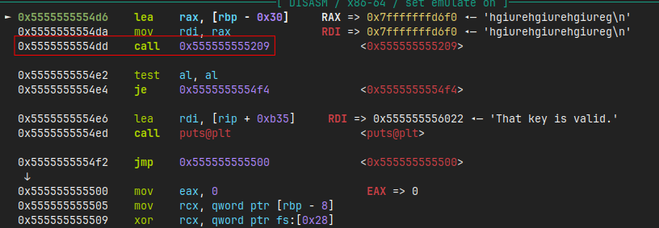
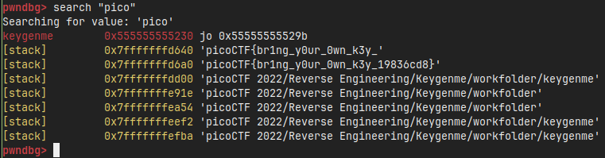

# Writeup for picoCTF 2022 : Keygenme

## Tools:
- Terminal/Command line
- Ghidra (NSA reverse engineering framework)
- GDB (GNU Debugger)
- File analysis utilities
- Assembly layout visualization

## Steps:

### 1. Initial Challenge Analysis and Program Execution
I began by giving the application proper execution permissions and running it to understand its basic functionality:

```bash
chmod +x keygenme
./keygenme
```

The program execution revealed that it was requesting a license key, indicating that this challenge involved license validation logic that I would need to reverse engineer to discover the correct key or extract the flag directly.



### 2. Static Analysis Using Ghidra
I loaded the binary into Ghidra to perform comprehensive static analysis. My approach was to locate key strings and trace them back to their usage in the code to understand the program's validation logic.

**String Analysis:**
Using Ghidra's 'Defined strings' feature, I located relevant output strings and followed their cross-references to understand how they were used in the program flow.





**Main Function Decompilation:**
The decompiled main function revealed the program's structure and validation process:



Key observations from the decompiled code:
- There's a validation process where `cVar1` receives the result of a validation function
- The validation function takes `local_38` (user input) as an argument
- Input is limited to 40 characters in the buffer, but `fgets` only reads `0x25` (37 decimal) characters
- This leaves 36 characters for actual input plus the null terminator `\0`

### 3. Validation Function Analysis
I examined the presumed validation function to understand its logic and requirements:



The validation function revealed a critical check: it verifies that the input length is exactly `0x24` (36) characters. While Ghidra's decompilation was somewhat unclear, this length check provided a useful target for dynamic analysis.

### 4. Dealing with Stripped Binary Challenges
When I attempted to analyze the binary further, I discovered it was stripped by running:

```bash
file keygenme
```

This meant that debugging symbols and function names had been removed, making traditional debugging more challenging. However, I could still work with available library functions like `printf` and `fgets`.



### 5. Dynamic Analysis Strategy with GDB
Since static analysis had limitations due to the stripped binary, I developed a dynamic analysis approach using GDB:

**Initial Breakpoint Strategy:**
```bash
gdb keygenme
(gdb) info functions
(gdb) b *fgets
(gdb) r
```

This approach allowed me to break at `fgets` when user input was being collected, providing a starting point for further analysis.

### 6. Navigating to the Validation Function
After breaking at `fgets`, I used the `finish` command to complete the function and return to the calling code:

```bash
(gdb) finish
```

This positioned me right after the input collection, where I could observe the subsequent validation function call.



I identified an interesting call to `0x555555555209`, which corresponded to the validation function I had seen in the Ghidra decompilation.

### 7. Locating the Length Comparison
I set a breakpoint at the validation function and used assembly layout to examine its structure:

```bash
(gdb) b *0x555555555209
(gdb) c
(gdb) layout asm
(gdb) n
```

By scrolling through the assembly, I located the critical comparison instruction:
```assembly
0x555555555419  cmp    rax,0x24
```

This instruction compared the input length against `0x24` (36), confirming the length requirement I had identified in the static analysis.

### 8. Flag Discovery Through String Search
With a breakpoint set at the length comparison, I performed a string search to locate any flag-related content:

```bash
(gdb) b *0x555555555419
(gdb) c
(gdb) search "pico"
```



The string search successfully revealed the flag embedded within the binary's memory, eliminating the need to reverse engineer the complete validation algorithm or generate a valid license key.

### 9. Learning Outcomes
This challenge effectively demonstrated several important reverse engineering concepts:
- **Combining static and dynamic analysis**: Using Ghidra for initial understanding and GDB for detailed investigation
- **Working with stripped binaries**: Adapting analysis techniques when debugging symbols are unavailable
- **Library function leveraging**: Using available functions like `fgets` as entry points into the main program logic
- **Validation bypass**: Sometimes finding the flag directly is more efficient than understanding the complete validation logic

The combination of multiple analysis approaches ultimately led to successful flag recovery without needing to generate a valid license key.

## Flag:
```picoCTF{br1ng_y0ur_0wn_k3y_19836cd8}```
