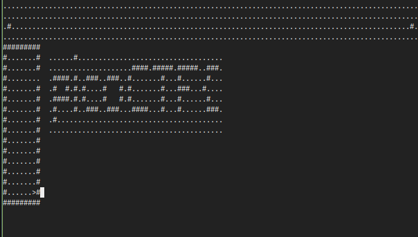

# Writeup for picoCTF-2022 : WizardLike

## Steps:
This ctf turned out to be pretty difficult and I almost gave up to look at writeups. Throughout the challenge I used tools like pwndbg and ghidra. However, after thoroughly checking the game out with both I noticed that nothing useful was being output. I decided I'd checkout the protection using pwn checksec and nothing really useful came out of that either. I tried running the application while debugging in gdb and noticed that I was able to run through the application step by step and see the assembly of it, and then it hit me that I had to do dynamic analysis of it and not static analysis with ghidra. However, before stepping into that rabbithole, I quickly looked over the strings of the game using `strings`, I looked through the entire list of outputs and noticed that a bunch of characters like those used in the game were in the output, `#`, `....`etc.. So I thought about reconstructing the game by adjusting the terminal size so I could see the entire map instead of the partial parts of the map that are visible by playing the game. By adjusting the terminal size I was able to see the maps properly with no vision impariering and beginning from the first level I saw this message:



After looking at the other levels and the characters provided in the visible maps, I constructed the flag below. 

Tricky challenge but using all the tools available helped a lot! One of the hints of the challenge also pointed at static analysis bein the wrong path to take, however, I technically did solve this using static analysis. 

## Flags
```picoCTF{ur_4_w1z4rd_8F4B04AE}```
