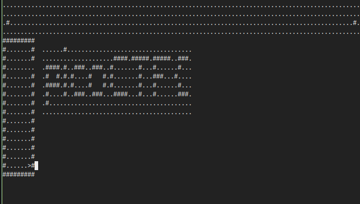

# Writeup for picoCTF 2022 : WizardLike

## Tools:
- pwndbg (Enhanced GDB debugger)
- Ghidra (NSA reverse engineering framework)
- pwn checksec (Binary protection analysis)
- strings command (String extraction utility)
- Terminal manipulation

## Steps:

### 1. Initial Challenge Analysis
This challenge presented me with what appeared to be a wizard-themed game that I needed to reverse engineer to extract the flag. The challenge proved to be particularly difficult, and I nearly resorted to looking up writeups multiple times throughout the process.

The game format suggested that the flag might be hidden within the game's data structures, level designs, or through some form of gameplay mechanics that required deeper analysis to uncover.

### 2. Attempting Static Analysis with Professional Tools
I began my analysis using industry-standard reverse engineering tools to examine the binary's structure and functionality.

**Using Ghidra:**
I loaded the binary into Ghidra, NSA's powerful reverse engineering framework, to perform comprehensive static analysis. However, after thoroughly examining the decompiled code, function structures, and data sections, I found that the output wasn't providing the insights I needed to locate the flag.

**Using pwndbg:**
I also employed pwndbg, an enhanced GDB plugin, to examine the binary's runtime behavior and memory layout. Despite its powerful debugging capabilities, this approach also failed to yield useful information about the flag's location.

### 3. Binary Protection Analysis
Recognizing that the binary might have specific protections or characteristics that were affecting my analysis, I used `pwn checksec` to examine the binary's security features:

```bash
pwn checksec wizardlike
```

Unfortunately, this analysis didn't reveal any specific protections or characteristics that would explain why my previous analysis attempts had been unsuccessful.

### 4. Dynamic Analysis Approach
Frustrated with the lack of progress from static analysis, I decided to attempt dynamic analysis by running the application within GDB. This approach allowed me to:

- Step through the application's execution instruction by instruction
- Examine the assembly code in real-time
- Observe how the program behaved during actual gameplay

This experience led me to realize that I might need to focus on dynamic analysis rather than static analysis, as suggested by one of the challenge hints.

### 5. String Analysis - The Breakthrough
Before diving deep into the complexity of dynamic analysis, I decided to take a step back and examine the binary using the fundamental `strings` command:

```bash
strings wizardlike
```

This command revealed a comprehensive list of all readable strings embedded within the binary. As I carefully examined the output, I noticed several significant discoveries:

- The presence of game characters like `#` and `.` that are used in the game's visual representation
- Map-related data and level structures
- Other game assets and text elements

### 6. Terminal Manipulation Strategy
The string analysis gave me a crucial insight: the game's visual representation might contain hidden information that wasn't visible during normal gameplay due to the limited terminal viewport. I hypothesized that by expanding the terminal size, I could view complete game maps instead of the partial views typically shown during gameplay.

By significantly adjusting my terminal dimensions, I was able to:
- View entire game levels without the normal vision limitations
- See complete map layouts rather than the small viewable areas
- Identify hidden messages and patterns within the level designs

### 7. Flag Discovery and Reconstruction
With the expanded terminal view, I systematically examined each game level, starting from the first level. This approach immediately proved successful when I discovered a hidden message embedded within the visible map structure:



By carefully analyzing all the levels and documenting the characters and patterns visible within the complete maps, I was able to reconstruct the flag by piecing together the information distributed across multiple game levels.

### 8. Verification and Solution
The flag I constructed from the level analysis followed the expected picoCTF format and contained meaningful content, confirming that my approach was correct. While the challenge hint suggested that static analysis was the wrong approach, my solution technically used static analysis (the `strings` command and visual inspection) rather than dynamic runtime analysis.

### 9. Learning Outcomes
This challenge was particularly valuable because it demonstrated:
- The importance of trying multiple analysis approaches when initial methods fail
- How simple tools like `strings` can sometimes be more effective than complex frameworks
- The value of thinking creatively about how information might be hidden (in this case, within game level layouts)
- That sometimes the most effective solution comes from stepping back and trying fundamental techniques

The combination of thorough tool exploration and creative problem-solving ultimately led to a successful flag recovery.

## Flag:
```picoCTF{ur_4_w1z4rd_8F4B04AE}```
