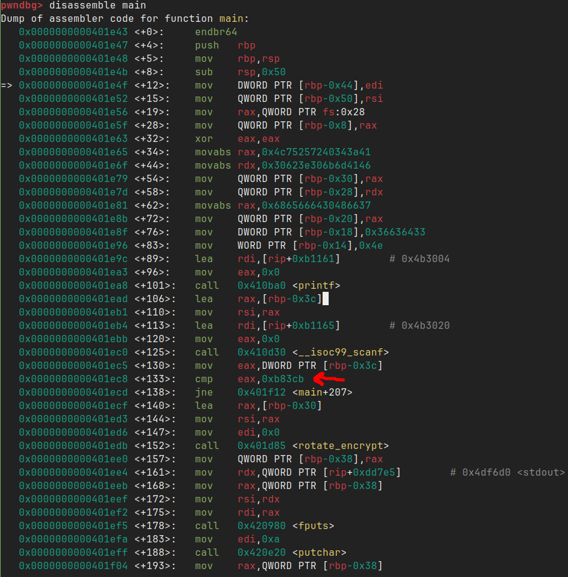
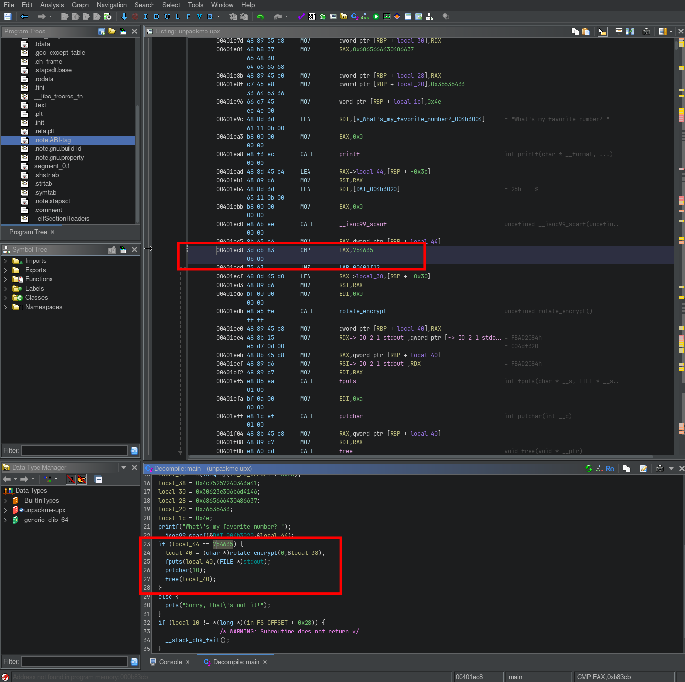

# Writeup for picoCTF 2022 : unpackme

## Steps:
1) First I gave the binary execution permissions and tried to run it:
```chmod +x unpackme-upx; ./unpackme-upx```
```
What's my favorite number? 54354353 
Sorry, that's not it!
```

So now we know that we're supposed to guess a correct number in order to get the flag.

2) I used various tools to check the file and get more information about it and its security. The name itself points out that there might be upx compression, but to be sure I checked any occurences of upx strings.
```strings unpackme-upx```
```
...
UPX!
UPX!
```

At the very bottom of the output I saw "UPX!" and that confirmed the compression type.

3) Next step was to download upx and decompress it.
```sudo pacman -S upx```
```upx -d unpackme-upx```

4) If we now open this file in pwndbg or ghidra it should be noticable that functions and strings are mostly visible.
```gdb unpackme-upx-decompressed```
```info functions main```
```disassemble main```


In the image above we've disassembled the main function. In it there's a cmp instruction pointed to by a red arrow. This compares a hexadecimal value presumable to check the gussed number. If we convert this to decimal we get `754635`.

This can also be seen using Ghidra in the image below where the code has been decompiled to pseudocode making it easier to read. 


5) Entering this number when running the application gives us the flag:
```
./unpackme-upx
What's my favorite number? 754635
picoCTF{up><_m3_f7w_5769b54e}
```

## Flag:
```
picoCTF{up><_m3_f7w_5769b54e}
```
