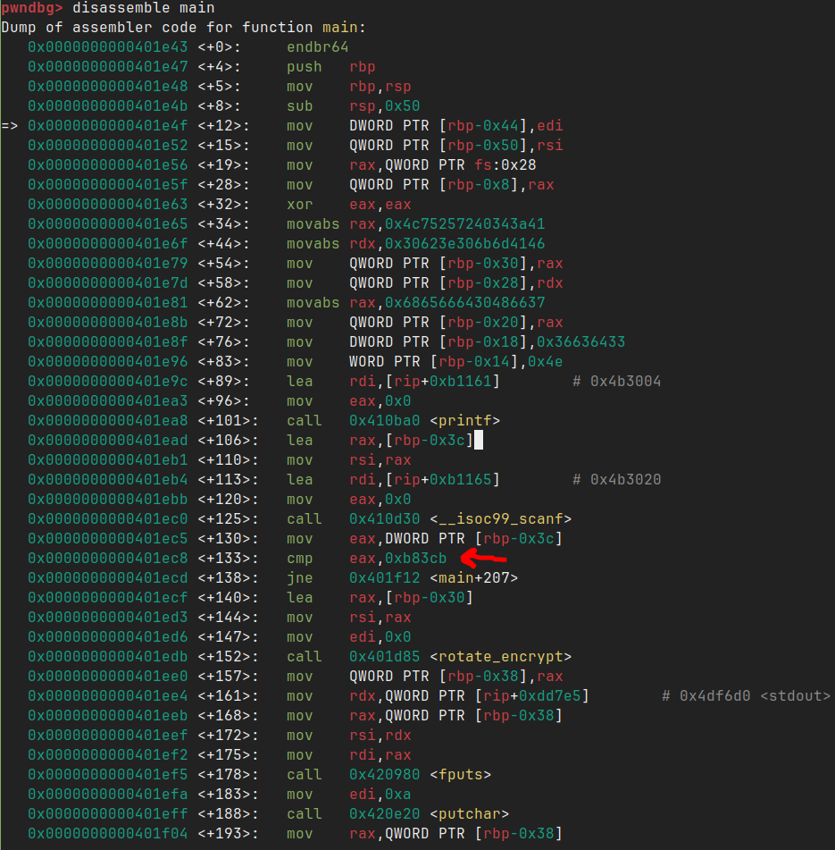
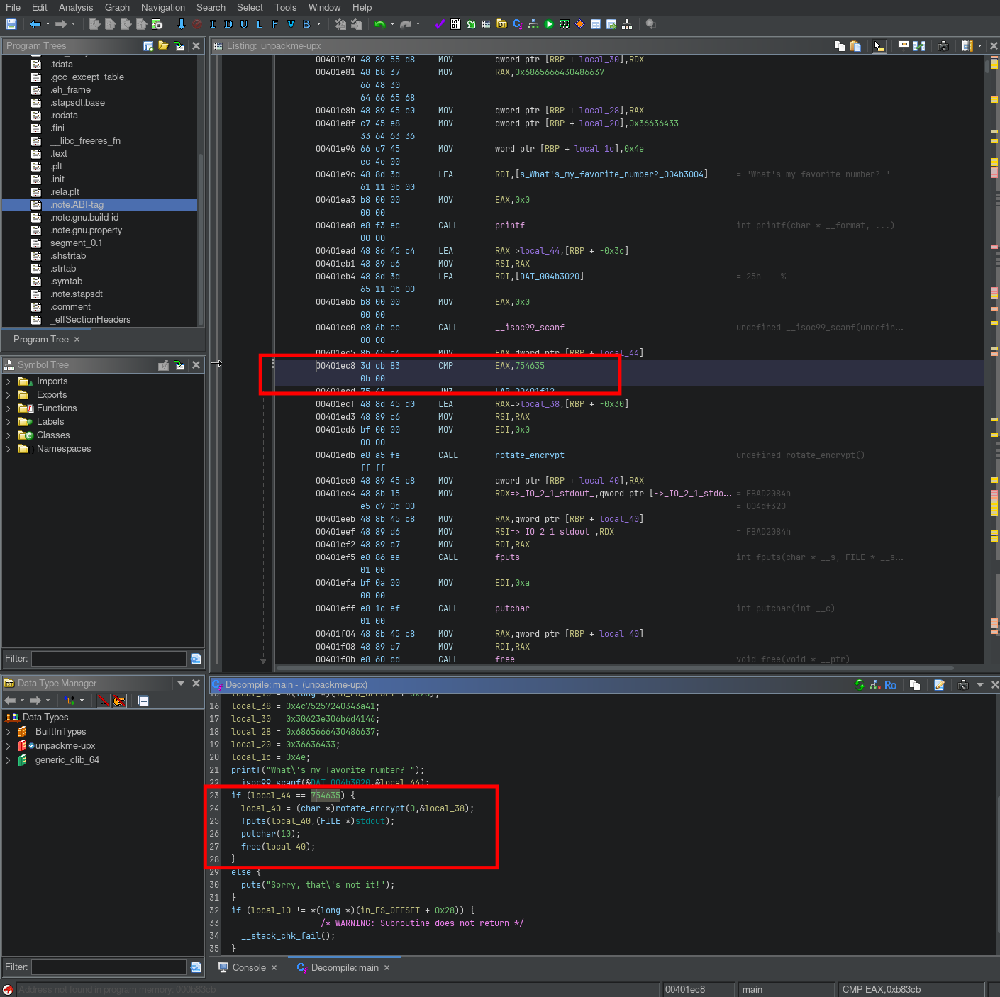

# Writeup for picoCTF 2022 : unpackme

## Tools:
- Terminal/Command line
- strings command (for string analysis)
- upx (Ultimate Packer for eXecutables)
- GDB/pwndbg (for dynamic analysis)
- Ghidra (for static analysis and decompilation)
- Hexadecimal to decimal conversion

## Steps:

### 1. Initial Program Execution and Reconnaissance
I began by giving the binary proper execution permissions and running it to understand its basic functionality:

```bash
chmod +x unpackme-upx
./unpackme-upx
```

The program output revealed:
```
What's my favorite number? 54354353 
Sorry, that's not it!
```

This initial execution immediately clarified the challenge's objective: I needed to determine the correct number that the program was expecting in order to retrieve the flag. The program appeared to be implementing a simple number-guessing mechanism with a hardcoded correct answer.

### 2. File Analysis and Compression Detection
The filename itself provided a significant clue with the "upx" suffix, suggesting that the binary might be compressed using UPX (Ultimate Packer for eXecutables). To confirm this hypothesis, I used the `strings` command to examine readable text within the binary:

```bash
strings unpackme-upx
```

Examining the output carefully, I found "UPX!" strings at the bottom of the results, which definitively confirmed that the binary was compressed using UPX. This discovery was crucial because packed binaries are often difficult to analyze in their compressed state, requiring decompression before effective reverse engineering can be performed.

### 3. UPX Installation and Binary Decompression
With the compression method confirmed, I proceeded to install UPX and decompress the binary:

```bash
sudo pacman -S upx
upx -d unpackme-upx
```

The decompression process restored the binary to its original, uncompressed state, making it accessible for standard reverse engineering tools and techniques. This step was essential because:
- Packed binaries obscure their true functionality
- Decompression reveals the actual program structure
- Standard analysis tools work more effectively on unpacked binaries

### 4. Static Analysis Using GDB
With the decompressed binary available, I loaded it into GDB to perform detailed analysis of its structure and functionality:

```bash
gdb unpackme-upx-decompressed
(gdb) info functions main
(gdb) disassemble main
```

The disassembly revealed the main function's structure, and I focused on identifying the comparison logic that would determine whether the guessed number was correct.



The critical discovery was a `cmp` instruction (highlighted with a red arrow in the image) that compared the user's input against a hardcoded hexadecimal value. This comparison instruction represented the core logic that determined whether the guessed number would result in flag disclosure.

### 5. Enhanced Analysis Using Ghidra
To gain a clearer understanding of the program's logic, I also analyzed the decompressed binary using Ghidra, which provided pseudocode representation of the assembly instructions:



Ghidra's decompilation made the program's logic much more readable and confirmed the presence of the hardcoded comparison value. The pseudocode clearly showed how the program compared the user's input against the expected value.

### 6. Hexadecimal to Decimal Conversion
The comparison instruction revealed that the program was checking the user's input against a specific hexadecimal value. To determine the correct decimal number to input, I converted this hexadecimal value:

**Conversion Process:**
- Hexadecimal value from assembly: (extracted from the cmp instruction)
- Decimal equivalent: 754635

This conversion gave me the exact number that the program was expecting as input.

### 7. Flag Retrieval
With the correct number identified, I executed the program again and provided the discovered value:

```bash
./unpackme-upx
What's my favorite number? 754635
picoCTF{up><_m3_f7w_5769b54e}
```

The program accepted the correct number and revealed the flag, confirming that my analysis and approach were successful.

### 8. Learning Outcomes
This challenge effectively demonstrated several important reverse engineering concepts:
- **Binary packing recognition**: Identifying compressed executables through filename hints and string analysis
- **Decompression techniques**: Using UPX to restore packed binaries to their original state
- **Multi-tool analysis**: Combining GDB and Ghidra for comprehensive program understanding
- **Number base conversion**: Converting between hexadecimal and decimal representations
- **Comparison logic analysis**: Understanding how programs validate user input

The challenge provided practical experience with a common obfuscation technique (binary packing) and showed how decompression enables standard reverse engineering approaches.

## Flag:
```picoCTF{up><_m3_f7w_5769b54e}```
