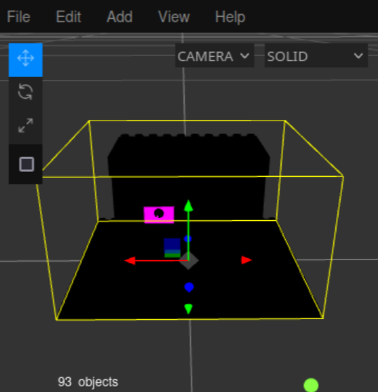
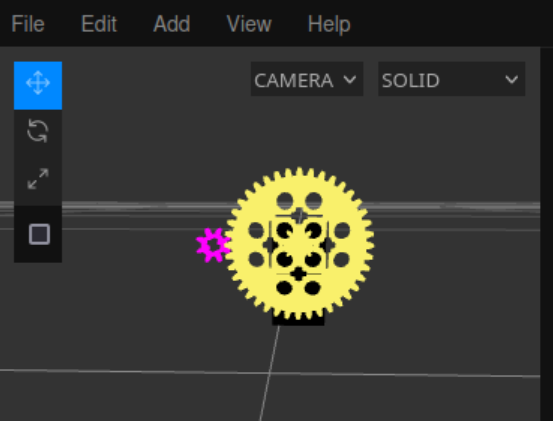

# Writeup for picoCTF 2023 : Virtual Machine 0

## Tools:
- three.js
- python3
- dencode.com

## Steps:
1) So for this challenge we're given a .dae file which is a COLLADA file that stands for digital asset exchange. Essentially it's a 3D model. Doing this challenge I managed to load it into an online 3D viewer


but from there I was confused and stuck for a while. I looked at the challenge hint which pointed at creating some kind of mathematical model, this didn't really help me that much. Eventually I gave up and looked at a writeup for this challenge. I was only interested in what to do after this step. After reading that disassembling the model would be required, I figured out why two specific gears were colored and the rest was black. There was a relation between the big gear colored in yellow and the small gear colored in pink. 


2) The task description states that "the rotation of the red axle is input and the rotation of the blue axle is output", and the hint states that "rotating the axle that number of times is obviously not feasible", all this info indicates that the input file which contains a long decimal number must be the amount of times to rotate the input gear, which is the pink gear.
3) There are 8 teeth on the small gear, while there's 40 on the large gear. That means the gear ratio os 40/8 = 5, so for every full rotation of the big gear, the small gear will rotate 5 times. This is surely what is meant by the mathematical relation in the task description or rather the hint in the task.
4) So if we take the number in the input file and multiply by 5 we get a huge number which theoretically should represent the amount of times the big gear has rotated when the small one has rotated the amount of times that is shown in the input.
5) This number turns out to be:
```python
>>> 39722847074734820757600524178581224432297292490103995916782275668358702105*5 = 198614235373674103788002620892906122161486462450519979583911378341793510525
```
6) Turns out this large number is encoded and after converting it to hex and then to ascii, using dencode, we get:
```
picoCTF{g34r5_0f_m0r3_5ca97824}
```

