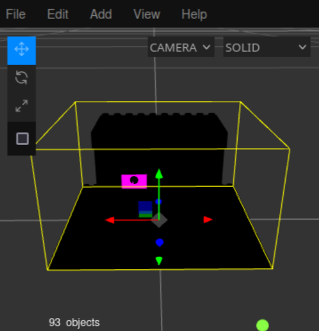
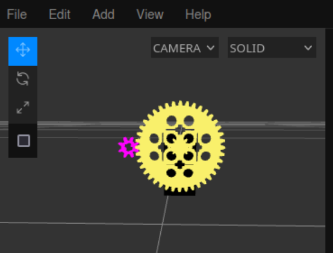

# Writeup for picoCTF 2023 : Virtual Machine 0

## Tools:
- Online 3D viewer (for COLLADA file visualization)
- Python 3 (for mathematical calculations)
- dencode.com (for hex-to-ASCII conversion)
- 3D model analysis

## Steps:

### 1. Initial Challenge Analysis and File Examination
This challenge presented me with a `.dae` file, which I learned is a COLLADA (COLLAborative Design Activity) file format used for digital asset exchange. Essentially, this was a 3D model that I needed to analyze to extract meaningful information.

The challenge title "Virtual Machine 0" and the file format suggested that I was dealing with a mechanical system that needed to be understood and analyzed mathematically rather than through traditional reverse engineering techniques.

### 2. Loading and Visualizing the 3D Model
I began by loading the COLLADA file into an online 3D viewer to examine its structure. The initial view revealed a complex mechanical assembly:



At first glance, the model appeared to be a gear system with multiple components. However, I was initially confused about how to proceed from this visualization, as it wasn't immediately clear what information I was supposed to extract or how it related to a flag.

### 3. Research and Hint Analysis
After spending considerable time trying to understand what the 3D model represented, I consulted the challenge hint, which mentioned creating "some kind of mathematical model." While this provided direction, it wasn't immediately clear how to apply this concept to the gear system I was observing.

Eventually, I decided to research similar challenges to understand the general approach. Through this research, I learned that the key was to "disassemble" the model to understand the relationships between different components, particularly focusing on gear ratios and mechanical relationships.

### 4. Identifying Key Components Through Disassembly
After disassembling the 3D model (separating its components for better analysis), I discovered why certain gears had specific colors while others were black:



The color coding was intentional and revealed the key components:
- **Yellow gear**: Large gear (40 teeth)
- **Pink gear**: Small gear (8 teeth)
- **Red axle**: Input mechanism
- **Blue axle**: Output mechanism

This color-coding system was the designer's way of highlighting the critical components for the mathematical analysis.

### 5. Understanding the Input-Output Relationship
The challenge description provided crucial information: "the rotation of the red axle is input and the rotation of the blue axle is output." Combined with the hint that "rotating the axle that number of times is obviously not feasible," this indicated that:

- The large decimal number in the input file represented the number of rotations for the input gear (pink gear)
- I needed to calculate the corresponding output without physically simulating the rotations
- The solution required understanding the mechanical advantage/gear ratio

### 6. Calculating the Gear Ratio
Through careful examination of the disassembled model, I counted the teeth on each gear:
- **Small gear (pink)**: 8 teeth
- **Large gear (yellow)**: 40 teeth

The gear ratio calculation:
```
Gear Ratio = Large Gear Teeth / Small Gear Teeth = 40/8 = 5
```

This means that for every complete rotation of the large gear, the small gear rotates 5 times. This mechanical relationship was the "mathematical model" referenced in the hint.

### 7. Applying the Mathematical Relationship
Using the gear ratio, I calculated the total rotations of the small gear when the large gear rotates the number of times specified in the input file:

```python
input_rotations = 39722847074734820757600524178581224432297292490103995916782275668358702105
gear_ratio = 5
total_small_gear_rotations = input_rotations * gear_ratio
```

The result was:
```python
198614235373674103788002620892906122161486462450519979583911378341793510525
```

### 8. Decoding the Final Result
The enormous number generated from the gear ratio calculation appeared to be encoded data. Following common CTF patterns, I converted this decimal number to hexadecimal format and then to ASCII characters using dencode.com.

The conversion process revealed the flag:
```
picoCTF{g34r5_0f_m0r3_5ca97824}
```

### 9. Learning Outcomes
This challenge was unique in that it combined:
- 3D model analysis and visualization skills
- Mechanical engineering concepts (gear ratios)
- Mathematical computation with large numbers
- Traditional encoding/decoding techniques

It demonstrated how CTF challenges can incorporate real-world engineering concepts and require interdisciplinary knowledge to solve effectively.

## Flag:
```picoCTF{g34r5_0f_m0r3_5ca97824}```

