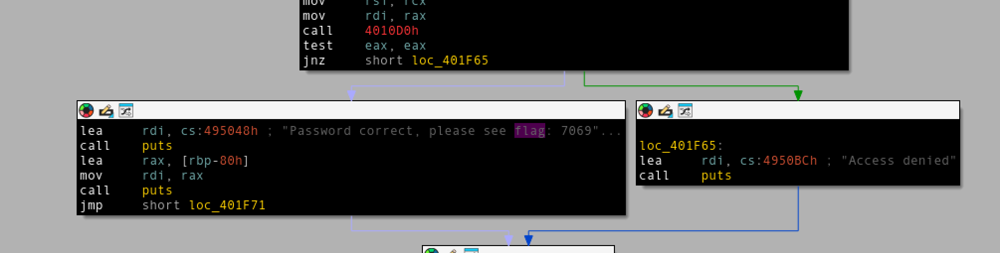

# Writeup for picoCTF 2023 : packer

## Tools:
- upx
- idapro
- dencode.com

## Steps:
1) First I checked out the hint provided by picoCTF. It hinted that the binary might've been compressed with something. I couldn't quite figure out how to find what compression algorithms the binary used, so at that point I would research other writeups and came across another writeup that mentioned it used upx. 
2) I then proceeded to install upx into my tools folder and attempted to understand it's parameters. After some time I figured out how to decompress the binary into it's original size, using: ```upx -d out -o ori```.
3) I proceeded to load up the original binary in ida pro and searched for the string "flag". I found:

4) Using dencode the string appeared to be a hex encoded string. Dencode automatically decodes it and the flag appears to be:
```picoCTF{U9X_UnP4ck1N6_B1n4Ri3S_6ff964ef}```
